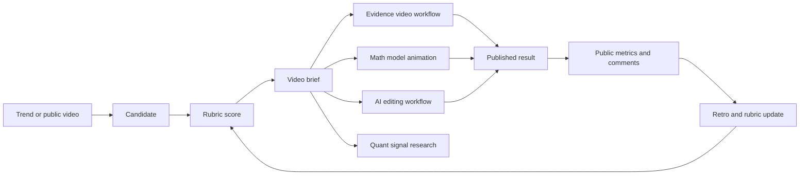

# Content Experiment Engine Integration Plan

The content experiment engine is the shared intelligence layer for topic
selection, public feedback mining, prediction, and post-publish learning. It is
not only a hotspot predictor.

## Capabilities

1. Discover candidates.
   - Manual topics.
   - Zhihu hot topics.
   - Weibo hot-search topics.
   - Public video URLs.
   - Future: Bilibili, Xiaohongshu, GitHub Trending, official reports, RSS.

2. Normalize candidates.
   - Stable id.
   - Source.
   - Snapshot text.
   - URL without tracking query.
   - Tags and risk flags.

3. Score candidates.
   - Emotional resonance.
   - Hook potential.
   - Quotable material.
   - Narrative arc.
   - Audience breadth.
   - Social resonance.
   - Evidence availability.

4. Generate workflow briefs.
   - Evidence-driven AI video.
   - Math/model board animation.
   - AI editing workflow.
   - Quant signal research.

5. Capture public performance.
   - Public video metrics.
   - Public comments.
   - Evidence screenshot.
   - Raw response archive for debugging.

6. Learn from outcomes.
   - Prediction before publishing.
   - Performance retro after publishing.
   - Comment mining.
   - Rubric adjustment.
   - Versioned experiment records.

## Workflow Routing

## Integration With Evidence Video

Use the brief as a production package seed:

- `topic` -> source search.
- `hook` -> first 3 seconds.
- `evidence_needed` -> source manifest checklist.
- `risk_notes` -> privacy/copyright review.
- `workflow_inputs` -> sync timeline and Remotion planning.

## Integration With Math Model Animation

Use the brief to choose the model and visual treatment:

- trend topic -> model framing;
- audience question -> explanatory caption;
- public comments -> confusing points to visualize;
- evidence source -> opening claim;
- target style -> `modern_tech` for wow effect or `teaching_derivation` for
  education.

## Integration With AI Editing

Use the brief to drive material collection:

- public clip references;
- screenshot targets;
- generated image prompts;
- caption rhythm;
- narrator framing;
- retention checks.

## Quant Use

The engine can help quant research, but it is not a trading signal by itself.

Useful paths:

- detect topic heat that may map to sectors, concepts, or listed companies;
- build an event timeline from hot-search and official-news timestamps;
- create sector watchlists from topic entities;
- compare topic heat with price/volume reaction windows;
- detect attention divergence: topic hot but sector not moving, or sector moving
  before public attention;
- help explain moves in post-trade review videos.

Required guardrails:

- never trade directly from social heat;
- map topics to stocks/sectors with an auditable entity linker;
- validate on historical data;
- separate event timestamp, media timestamp, and market reaction timestamp;
- check leakage: if market moved before the topic was captured, it is not a
  predictive signal.

## Next Milestones

1. Add `content_candidates` import/export to SQLite.
2. Add a small web console for candidates, briefs, and snapshots.
3. Add Bilibili public adapter. Done in `bilibili_public_video`.
4. Add prediction/retro markdown generation. Done in `prediction_records`.
5. Add entity linking for quant research.
6. Add workflow-specific exporters:
   - evidence production package;
   - model animation scene config;
   - AI editing shot list.
